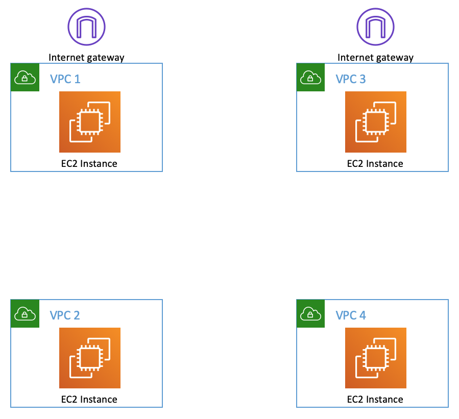
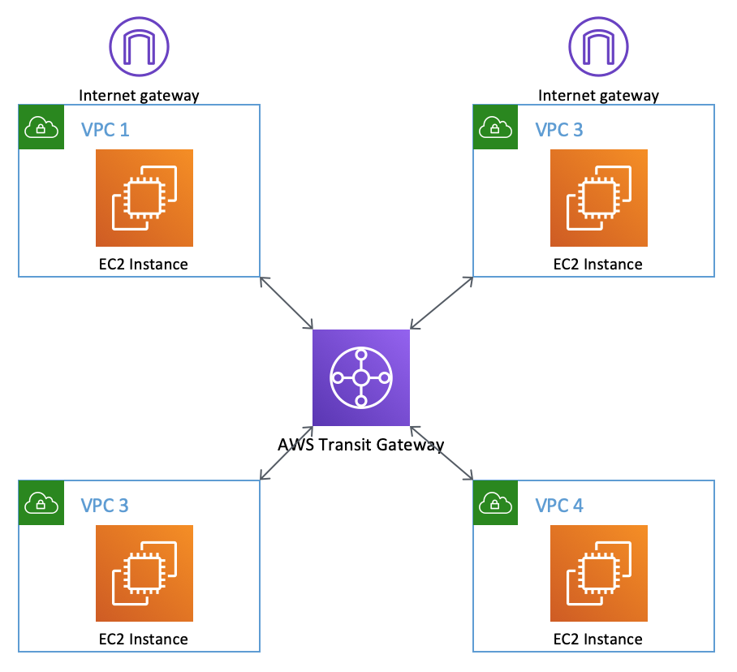
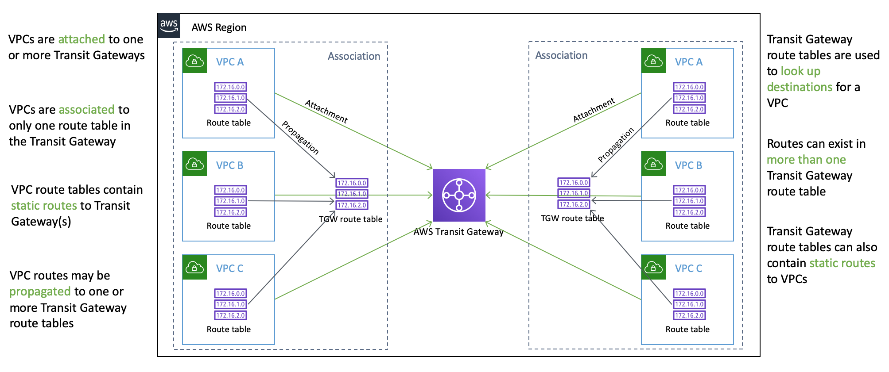

## AWS Transit Gateway Routing Lab

This is a short lab covering [Transit Gateway](https://aws.amazon.com/transit-gateway/). You'll use Transit Gateway to link four VPCs together in a few different ways to see how the various components within the service can provide you with flexible ways of performing networking within AWS.

This lab should take about an hour to complete.

## License Summary

This sample code is made available under the MIT-0 license. See the LICENSE file.

## Requirements
You will need an AWS account to run this lab. You will need a tool that allows you to SSH to EC2 instances in order to test connectivity between your VPCs. You must also have an existing SSH key pair in the region you are going to operate in.

This lab will result in charges to your AWS account. The instances launced are all t3.nano so it won't break the bank but there are still some costs. There are also charges associated with Transit Gateway. Ensure that you delete the lab template at the end to prevent further charges - there are instructions for how to do this at the end of the lab.

## Lab Instructions
### Setup
Using the [CloudFormation template](tgw-lab.yaml) in this repo, launch a stack in the region of your choice that supports Transit Gateway.

The template creates four VPCs and four EC2 hosts (one in each region) as per the following diagram.



You must select a SSH key pair in the region you are using. If you haven't already done so, create a key pair before launching the template.

VPC 1 and VPC 3 have Internet access. You will be able to directly SSH to those instances using the key pair you choose. The public and private IP addresses for all of the instances will be in the Outputs section of the CloudFormation stack in the console. You may also see that information in the EC2 console.

Each instance has a security group that allows SSH and ICMP from anywhere so you can perform connectivity checks and troubleshooting.

### Task 1: Check Public and Private Connectivity
SSH to the instances in VPC 1 and VPC 3 using their public IP addresses.

Try and ping the private IP addresses of all the other instances. This currently won't work because there is (deliberately) no connectivity between the VPCs.

In order to make troubleshooting easier in the next few steps, copy the SSH key you have to the instances in VPC 1 and VPC 3. On a Mac or Linux desktop you can use scp:
```
scp -i <key name> <key name> ec2-user@<public ip>:
```

On a Windows desktop you should use a tool like PSCP (Putty SCP).

### Task 2: Create Transit Gateway and Enable VPC Communication
Open the VPC console and go to the "Transit Gateways" section and create a new transit gateway. During creation, disable the "Default route table association" and "Default route table propagation" options. These options automatically associate a route table to a VPC and propagate their routes. You're going to do this manually so that you can see the processes necessary to create more complex routing topologies.

In the "Transit Gateway Attachments" section attach each of the four VPCs to the Transit Gateway. Note that each VPC only has a single subnet but in a production environment you would normally attach all subnets to the Transit Gateway. A subnet without an attachment can only reach the Transit Gateway through another subnet which would be acceptable if the subnets were in the same availability zone. If they weren't, there would be cross-AZ traffic so it is generally best to attach all subnets to the Transit Gateway.

Conceptually, what you've created is the following network:



Now SSH back to the instances in VPC 1 and VPC 3. Try and ping the private addresses of the other instances. This doesn't work because attaching the VPCs to the Transit Gateway doesn't automatically create a routing topology - in this case because the automatic association and propagation was disabled in the Transit Gateway creation above.

### Task 3: Associate VPCs with Transit Gateway
Inn the "Transit Gateway Route Tables" section of the console create a route table. Then associate each of the four VPCs with that route table.

The association process tells Transit Gateway which route table to use when packets leave a VPC. There can only be a single Transit Gateway route table associated with the VPC. Note that if "Default route table association" was enabled during the Transit Gateway creation then this would have automatically happened when you attached the VPC to the Transit Gateway.

SSH to the instances in VPC 1 and VPC 3 again then try and ping the other instances. This still doesn't work. Even though the Transit Gateway now knows which route table to use when packets are coming from those VPCs you haven't given the route table any routes - that is, where to send the packets next. You can verify this by looking at the "Routes" tab in the console for the Transit Gateway Route Table - there are none there. This means that Transit Gateway will drop those packets once they leave the VPC and come into the Transit Gateway because there is no valid destination.

### Task 4: Enable Route Propagation in the Route Table
The "Propagations" tab in the Transit Gateway Route Table instructs Transit Gateway where to send packets next.

When "Default route table propagation" is enabled it means that VPCs that are attached to the Transit Gateway will automatically have their routes added to the default route table. You've disabled this otherwise this would be a really boring lab...

Manually add a propagation to the Transit Gateway Route Table for each VPC.

Once again, SSH to the instances and try to ping the other instances. You've pretty much completely configured Transit Gateway but this still doesn't work. The reason is that the VPCs don't know how to route to the Transit Gateway. Even though you have attached the VPC to the Transit Gateway and associated a Transit Gateway route table to each VPC you haven't modified the VPC route tables at all. Unlike VPN and Direct Connect, Transit Gateway does not automatically add routes to the VPC route tables.

You can confirm this by looking at the VPC route tables for each VPC. They only have their own internal routes (172.17.x.0/24) and a default route (0.0.0.0/0) in VPC 1 and VPC 3 going to their respective Internet Gateways.

### Task 5: Adding Transit Gateway Routes to the VPC Route Tables
In the VPC console, open the route table for VPC 1. Add a route where the destination network is "172.16.0.0/16" and the target (where the packets should go) is the Transit Gateway. This tells the VPC that all packets for any 172.16.x.x network are via the Transit Gateway.

Note that if you wanted all traffic to go via the Transit Gateway you would use a default route (0.0.0.0/0) but you can't do that in this case because there is already a default route to the VPC Internet Gateway.

SSH to the host in VPC 1 and try to ping the other instances. Note that this still doesn't work because routing is a two-way process and it has to happen at every step of the way. VPC 1 knows how to route to the other VPCs but they don't know how to route back. If you were running a packet debug on the host in VPC 3 and you were pinging the internal address you would see the ICMP packets hitting the host and the replies being sent - but they would never reach VPC 1 because there is no route in VPC 3 back to VPC 1.

So, go back to the VPC console and open the route table for VPC 3. Here again, add a route for network "172.16.0.0/16" where the target is the Transit Gateway.

In the route tables for VPC 2 and VPC 4, add a route for network "0.0.0.0/0" where the target is your Transit Gateway. In these two VPCs you can use a default route because you do want all traffic to go to the Transit Gateway - there is no Internet Gateway route to worry about. Note that using a route of "172.16.0.0/16" in these VPCs would work just as well.

If you now SSH to the instance you can ping and SSH between their private addresses. You have full connectivity between all of the VPCs via Transit Gateway.

### Task 6: Internet Connectivity Check
Now that you have a working network let's see if Internet connectivity is available from VPC 2 via VPC 1 - after all, VPC 1 has an Internet Gateway.

Add a default route to the Transit Gateway Route Table. The CIDR (the destination network) is "0.0.0.0/0" and VPC 1 is the attachment you want it to use. That's all you have to do because there is a default route in VPC 2 that is sending all traffic to the Transit Gateway and once the traffic is routed to VPC 1 there is a default route there sending all traffic to the Internet Gateway.

SSH to the instance in VPC 1 and verify you can ping something on the internet like www.amazon.com.

Then SSH to the instance in VPC 2. Can you ping www.amazon.com?

Spoiler: No, you can't. This same scenario will also fail if the VPCs are peered together and there is no Transit Gateway in the mix. In both situations, the non-transitive routing attribute of VPCs takes over - traffic that enters a VPC from another VPC can't then exit.

But can you use a VPC as your Internet transit for all other VPCs? Absolutely. The most common way of doing this is to put a proxy server farm in VPC 1 and direct all Internet traffic to it. You can see an example of this [on our security blog](https://aws.amazon.com/blogs/security/how-to-set-up-an-outbound-vpc-proxy-with-domain-whitelisting-and-content-filtering/).

### Task 7: Isolate VPCs and Reconnect
In this exercise, you're going to create a network where VPC 1 and VPC 2 can communicate; VPC 3 and VPC 4 can communicate; but the two pairs (1 and 2; 3 and 4) can't communicate with each other.

In the Transit Gateway Route Table, remove all references to VPC 3 and VPC 4. You will need to delete the propagations and associations for those VPCs to the route table. This will mean that VPC 1 and VPC 2 can still communicate via the route table but VPC 3 and VPC 4 will be totally isolated. Confirm that you've removed all references by checking the "Routes" tab in the Transit Gateway Route Table and ensuring there are no routes for VPC 3 (172.16.3.0/24) and VPC 4 (172.16.4.0/24).

Create a new Transit Gateway Route Table. Associate VPC 3 and VPC 4 to the new route table and then propagate the routes from VPC 3 and VPC 4 to the route table as well. Again, confirmm that the routes for those VPCs are in the "Routes" tab.

SSH to the instance in VPC 1. From it you can connect to the instance in VPC 2 but not the instances in VPC 3 or VPC 4. Similarly, from the instance in VPC 3 you can connect to VPC 4 but not VPC 1 nor VPC 2.

### Task 8: Establish Partial Connectivity
Next, you'll set up Transit Gateway so that only the two private VPCs (VPC 2 and VPC 4) can communicate.

In the original Transit Gateway Route Table add a propatagion for VPC 4. In the second Transit Gateway Route Table that you created in the previous exercise, add a propagation for VPC 2.

Check the "Routes" tab in both route tables to ensure that you have routes to the VPCs that are "in" the other route table.

SSH to the instance in VPC 2 (which you'll need to do via the instance in VPC 1). You should be able to communicate with the instance in VPC 4 using the private IP address. This is because the route table associated with VPC 2 knows a route to VPC 4. And the route table associated with VPC 4 knows a route to VPC 2.

From the instance in VPC 2 try and communicate with the instance in VPC 3. This will not work because there is no route in the Transit Gateway Route Table associated with VPC 2 going to VPC 3. Packets simply cannot get there.

Alternately, SSH to the instance in VPC 3 and try and connect to the instance in VPC 2. This will not work for exactly the same reason. Even though there is a route in the Transit Gateway Route Table associated with VPC 3 that allows packets to go to VPC 2 there is no return route to VPC 3. There must be routes in both directions for communications to occur.

### Teardown
When you're finished, delete the Transit Gateway Attachments for each VPC to the Transit Gateway.

Once they're deleted, delete the Transit Gateway.

When done, delete the CloudFormation stack.

### Conclusion
In this lab you've seen how Transit Gateway can be used to connect VPCs together in a few different ways.

One final diagram as a reference to the way VPCs are attached, associated and propagated within Transit Gateway.


